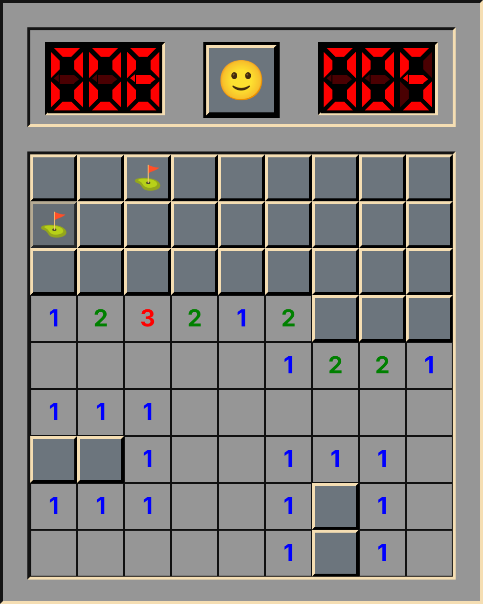

# minesweeper

[](https://github.com/lteyjolfur/minesweeper/actions/workflows/ci.yml)

A Minesweeper game in React and TypeScript, with a red seven-segment display, an emoji smiley and emoji tiles.

**[Play it in the browser](https://lteyjolfur.github.io/minesweeper/)**



## How to play

Open every square that isn't a mine. A number tells you how many of the eight squares around it are mines. Your first click is always safe, and so are the squares around it.

| Action                       | Control                                         |
| ---------------------------- | ----------------------------------------------- |
| Reveal a square              | Left click                                      |
| Flag ⛳, then ❓, then clear | Right click                                     |
| Chord (open the neighbours)  | Double click a number, or left + right together |
| New game                     | Click the smiley                                |

**Chording:** on a revealed number whose adjacent flags match it, a double click opens all of its other neighbours at once. If a flag is wrong, you hit a mine.

The left counter is mines minus flags and can go negative. The right counter is seconds. The face is 🙂 normally, 😯 while you press, 😎 when you win and 💀 when you lose.

## How it's built

React class components in `src/components/`: `game.tsx` holds the game state and rules, and `board.tsx`, `square.tsx`, `counter.tsx`, `sevenSeg.tsx` and `smiley.tsx` draw it. The seven-segment digits are plain CSS shapes. Mines are only placed after the first click, which is how the first click stays safe, and opening an empty area is a breadth-first flood fill.

## Development

Requires Node.js 22 (see `.nvmrc`).

```bash
npm ci
npm run dev
```

| Script                                    | What it does                     |
| ----------------------------------------- | -------------------------------- |
| `npm run dev`                             | Start the Vite dev server        |
| `npm run build`                           | Typecheck, then build to `dist/` |
| `npm run preview`                         | Serve the production build       |
| `npm test`                                | Run the Vitest suite             |
| `npm run typecheck`                       | `tsc --noEmit`                   |
| `npm run lint`                            | ESLint                           |
| `npm run format` / `npm run format:check` | Prettier                         |

CI (`.github/workflows/ci.yml`) runs typecheck, lint, format check, tests, build and `npm audit` on every pull request and push. Pushes to the default branch also deploy `dist/` to GitHub Pages.

**One-time setup:** in the repository, go to **Settings → Pages → Source** and choose **GitHub Actions**.

## License

[MIT](LICENSE)
